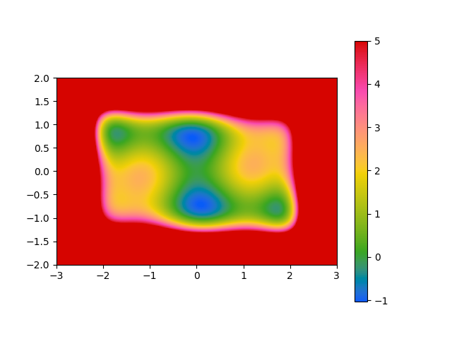
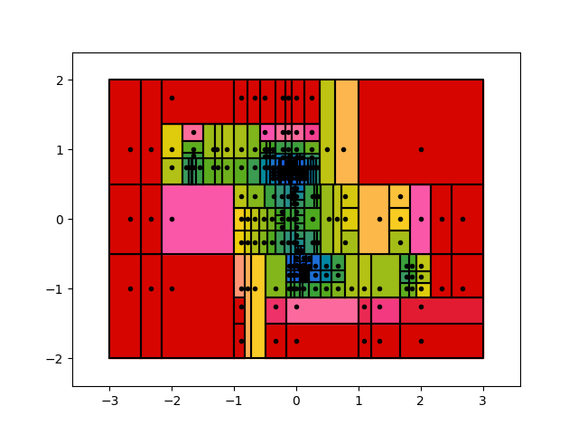

# QuadDIRECT

[](https://travis-ci.org/timholy/QuadDIRECT.jl)

[](http://codecov.io/github/timholy/QuadDIRECT.jl?branch=master)

QuadDIRECT is an algorithm for global optimization without requiring derivatives. It was inspired by [DIRECT](https://www.tol-project.org/export/3756/tolp/OfficialTolArchiveNetwork/NonLinGloOpt/doc/DIRECT_Lipschitzian%20optimization%20without%20the%20lipschitz%20constant.pdf) and [MCS](http://www.mat.univie.ac.at/~Neum/ms/mcs.pdf):

DIRECT: Jones, Donald R., Cary D. Perttunen, and Bruce E. Stuckman. "Lipschitzian optimization without the Lipschitz constant." Journal of Optimization Theory and Applications 79.1 (1993): 157-181.

MCS: Huyer, Waltraud, and Arnold Neumaier. "Global optimization by multilevel coordinate search." Journal of Global Optimization 14.4 (1999): 331-355.

There is no formal published description (yet), but it expands upon DIRECT by:
- allowing boxes to be of different sizes, and supporting boxes that extend to infinity
- it splits boxes at points suspected of being minima as judged by a
  local quadratic model of the function.

As a simple demonstration, consider the "6-hump camel function":

```julia
julia> function camel(x)
            # 6-hump camel function. Typically evaluated over [-3,3] × [-2,2].
            x1, x2 = x[1], x[2]
            x1s = x1*x1
            x2s = x2*x2
            return (4 - 2.1*x1s + x1s*x1s/3)*x1s + x1*x2 + (-4 + 4*x2s)*x2s
        end
end
```



Here the value scale was cut off at 5 so that the structure of the minima can be seen.
You can explore this function with

```julia
julia> using QuadDIRECT

julia> lower, upper = [-3,-2], [3,2]   # domain over which we allow solutions
([-3, -2], [3, 2])

julia> splits = ([-2, 0, 2], [-1, 0, 1])   # initial locations to evaluate function
([-2, 0, 2], [-1, 0, 1])

julia> root, x0 = analyze(camel, splits, lower, upper)
(BoxRoot@[NaN, NaN], [0.0, 0.0])
```

This creates a tree structure (currently) with 327 boxes, each corresponding to a single function evaluation:



You can see that it has concentrated its function evaluations near the global minima.
This plot was generated by utilities in `QuadDIRECT/src/plotting.jl`, which have to be
loaded separatedly from the `QuadDIRECT` module.

You can inspect the minimum like this:

```julia
julia> box = minimum(root)
Box-1.0316284406055976@[0.0898781, -0.71269]

julia> value(box)
-1.0316284406055976

julia> position(box, x0)
2-element Array{Float64,1}:
0.0898781
-0.71269
```

These match the known global optima to reasonably high precision.

There's also a convenience function `minimize` which just returns the location and value of the
minimum.

For more examples, see the `demo` directory.
